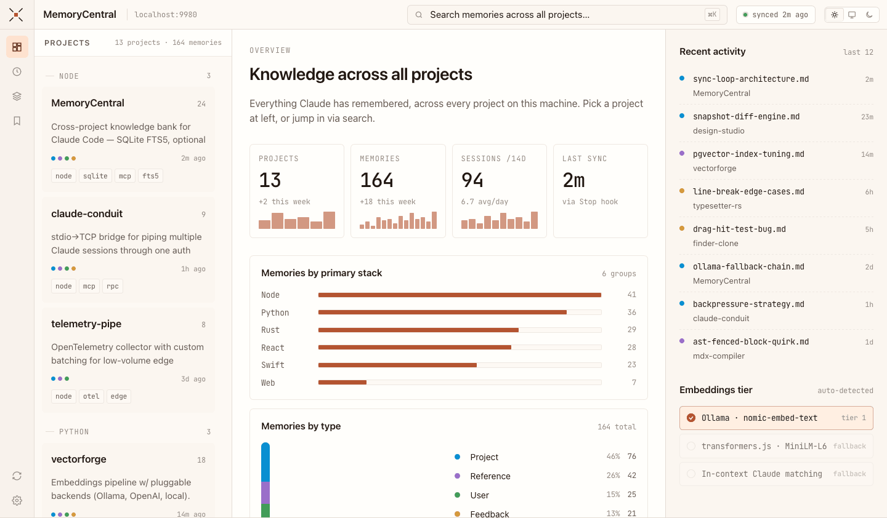
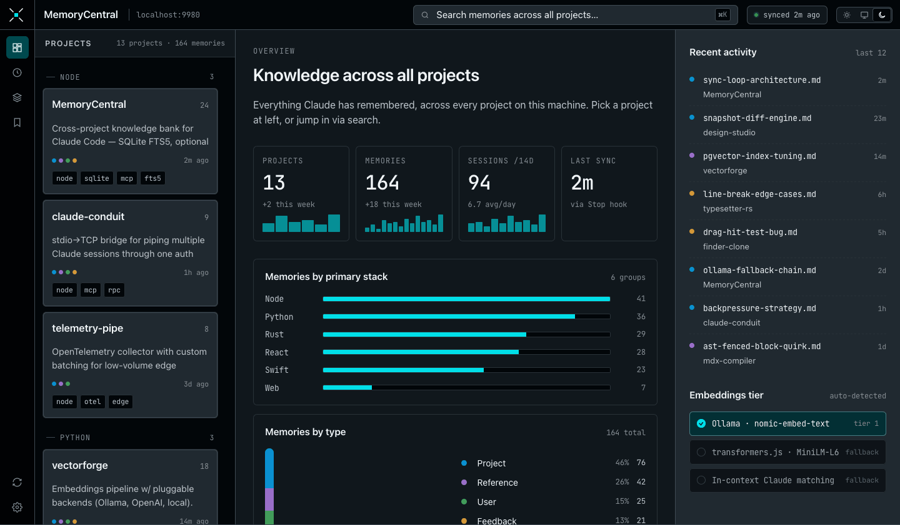
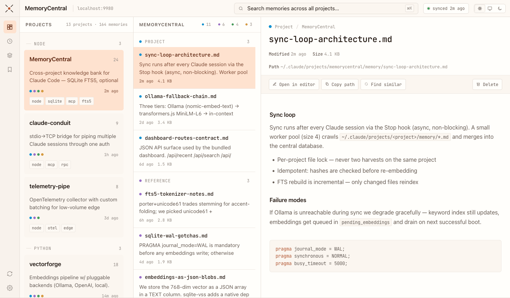
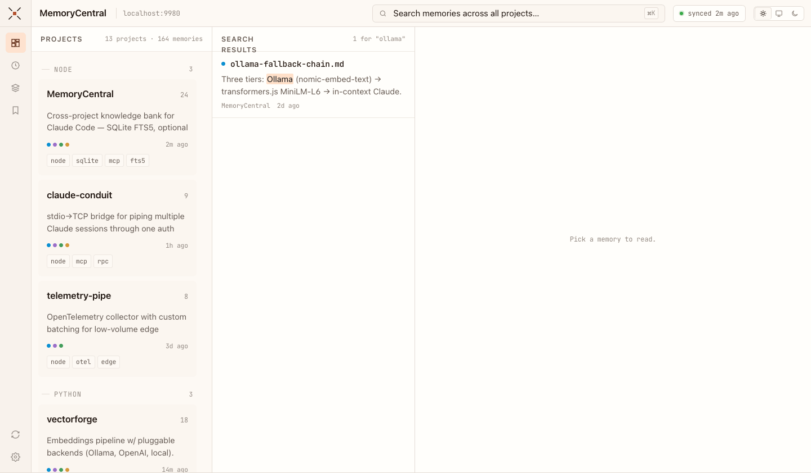

<p align="center">
  
</p>

<p align="center">Cross-project knowledge bank for Claude Code. Harvests memory files from every Claude project on your machine into a searchable SQLite database, exposed as a global MCP server.</p>

<p align="center"><strong>macOS · Windows · Linux</strong></p>

---



<details>
<summary>More screenshots</summary>







</details>

---

## What it does

- Harvests `~/.claude/projects/*/memory/*.md` from all your Claude sessions
- Stores everything in SQLite with full-text search (FTS5) and optional semantic embeddings
- Exposes 9 MCP tools available in **every** Claude session, globally
- Auto-syncs after each session via a Stop hook (async, non-blocking)
- Local web dashboard at `http://localhost:9980` — Finder-style three-column browser
- Export/import for machine migration and backup

## Prerequisites

| Requirement | Notes |
|-------------|-------|
| **Node.js 22+** | Required for built-in `node:sqlite`. [nodejs.org](https://nodejs.org) |
| **Claude Code** | The CLI — [claude.ai/code](https://claude.ai/code) |
| **Ollama** _(optional)_ | Enables richer semantic search and project metadata. [ollama.com](https://ollama.com) |

## Install

```bash
git clone https://github.com/yogiee/MemoryCentral
cd MemoryCentral
node setup.js
```

`setup.js` will:
1. Check your Node.js version
2. Install dependencies (`npm install`)
3. Register the MCP server globally (`claude mcp add --scope user`)
4. Print a Stop hook snippet to add to `~/.claude/settings.json`
5. Run the first sync

Then **start a new Claude Code session** — `memoryCentral` tools will be available.

## Dashboard

The dashboard starts automatically at `http://localhost:9980` alongside the MCP server in every Claude session. Run it standalone anytime:

```bash
node dashboard.js
```

### Layout

Three-column Finder-style browser — always visible:

| Column | Content |
|--------|---------|
| **Projects** (320px) | All tracked projects grouped by primary stack tag |
| **Memories** (360px) | Memory list for the selected project, search results, or recent feed |
| **Detail** | Full memory content rendered from Markdown |

### Features

- **Overview landing** — stat tiles, memories-by-stack bar chart, memories-by-type breakdown, recent activity feed, embeddings tier indicator
- **Project view** — memories grouped by type (project / reference / user / feedback) with type-filter pills
- **Full-text search** — FTS5 with `<mark>` highlighted excerpts, debounced as you type
- **Recent activity** — last 12 modified memories across all projects via rail button
- **Memory detail** — Markdown rendered in-pane; Copy path, Find similar, and Delete actions
- **Light / Dark / System** themes — persisted to `localStorage`
- **Sync button** — triggers a full harvest from the rail without leaving the browser
- **Cmd-K** — focuses search from anywhere; Esc clears and returns to previous view

### Keyboard shortcuts

| Shortcut | Action |
|----------|--------|
| `Cmd-K` / `Ctrl-K` | Focus search |
| `Esc` (in search) | Clear search and return to previous view |

## MCP Tools

| Tool | Description |
|------|-------------|
| `list_projects` | All tracked projects with description, stack tags, memory count |
| `get_project_summary` | Structured overview: description, stack, memory list by type |
| `get_project_memories` | Full content of all memory files for a project |
| `search_memories(query, project?)` | FTS keyword search across all projects (or one) |
| `find_similar(description)` | Semantic search — see [Semantic Search](#semantic-search) below |
| `find_by_stack(tag)` | All projects using a given tech tag (swift, node, python…) |
| `save_memory(project, filename, content)` | Write a memory mid-session — filesystem + DB + embeddings |
| `get_dashboard` | Cross-project dashboard grouped by primary stack tag |
| `sync` | Trigger a full harvest from all Claude project sessions |

## Sync

Sync runs automatically after each session via the Stop hook. To run manually:

```bash
node sync.js
```

## Project-level Memory Integration

Some projects keep memory files outside the standard `~/.claude/projects/*/memory/` path — for example a `memory-bank/` folder inside the project repo itself (common with Cursor or Cline workflows). MemoryCentral can harvest those too.

Create `~/.memorycentralrc.json` and declare extra scan paths per project name:

```json
{
  "extraPaths": {
    "inspector": ["/Users/you/work/inspector/memory-bank"],
    "another-project": ["/path/to/docs", "/another/path"]
  }
}
```

- Project names must match exactly as shown in the dashboard or `list_projects`
- Multiple directories per project are supported
- Files are merged into the same project entry — fully searchable alongside Claude memory files
- The config is machine-specific and never committed to git

Run `node sync.js` after adding the config to pick up the new files immediately.

## Backup and Restore

### Export

```bash
node export.js
# → memoryCentral-backup-2026-05-28.json.gz
```

Creates a compressed backup of all memory files. Use this before reinstalling your OS or migrating to a new machine.

### Import

```bash
node import.js memoryCentral-backup-2026-05-28.json.gz
```

Restores all memory files and rebuilds the database automatically.

**Same machine / same username:** everything restores in place automatically.

**New machine or new username:** files are restored to the same encoded paths. Claude Code will find them once you open the corresponding projects from the same absolute paths. The import prints a manifest so you can see exactly which projects are in the backup.

---

## Semantic Search

`find_similar` uses vector embeddings to find memories by concept rather than keyword. It works in three tiers depending on what's available:

### Tier 1 — Ollama (recommended)

If [Ollama](https://ollama.com) is running with `nomic-embed-text` installed, it's used automatically. Ollama can be local or on another machine on your network.

```bash
ollama pull nomic-embed-text
```

Highest quality embeddings, runs entirely offline, zero API cost.

**Remote Ollama:** set `OLLAMA_HOST` in the MCP server config in `~/.claude.json`:

```json
"memoryCentral": {
  "command": "node",
  "args": ["/path/to/MemoryCentral/server/index.js"],
  "env": { "OLLAMA_HOST": "http://192.168.1.50:11434" }
}
```

Defaults to `http://localhost:11434` when not set.

### Tier 2 — transformers.js (no setup required)

If Ollama isn't available, MemoryCentral falls back to [`@huggingface/transformers`](https://huggingface.co/docs/transformers.js) running `all-MiniLM-L6-v2` directly in Node.js.

- No service to run — model loads inside the Node process
- First use downloads ~25 MB and caches locally (one time only)
- Slightly lower quality than nomic-embed-text but still meaningfully semantic

### Tier 3 — In-context Claude matching (always works)

If neither Tier 1 nor Tier 2 is available, `find_similar` returns all memory content for Claude to match using its own understanding. Uses more context window but requires zero setup.

### Project metadata extraction

When Ollama is running, sync also uses `llama3.1` to auto-extract human-readable descriptions and stack tags for each project. Without Ollama, descriptions show as `_unknown_` — but all memory content is still fully indexed and searchable.

### Capability summary

| Feature | No Ollama | With Ollama |
|---------|-----------|-------------|
| `search_memories` (keyword) | ✓ Full | ✓ Full |
| `find_similar` (semantic) | ✓ Via transformers.js or Claude | ✓ Best quality |
| Project descriptions + stack tags | ✗ Empty | ✓ Auto-extracted |
| Dashboard embeddings tier | Tier 2 / 3 shown | Tier 1 shown |

---

## Architecture

```
~/.claude/projects/<project>/memory/*.md   ← Claude writes here per session
              ↓  node sync.js  (Stop hook + manual)
stats/knowledge.db                         ← SQLite: FTS5 + embeddings
              ↓  server/index.js  (MCP server + dashboard)
Any Claude session                         ← 9 MCP tools, cross-project search
              ↓  save_memory tool
~/.claude/projects/<project>/memory/*.md   ← writes back to filesystem
http://localhost:9980                      ← local dashboard (auto-starts)
```

## What's in git

The repo contains only the **engine** — no personal data is ever committed.

```
server/         MCP server, sync logic, dashboard HTTP server
server/public/  Dashboard HTML + CSS + JS (no build step)
server/assets/  Icon SVGs
setup.js        One-time setup
sync.js         Stop hook entry point
export.js       Backup utility
import.js       Restore utility
docs/           Screenshots
```

Personal data (memories, snapshots, database) lives locally and never leaves your machine unless you explicitly run `node export.js` and share the file.

## Stack

- **Node.js 22+** — `node:sqlite` built-in (zero native deps for core)
- **SQLite** — WAL mode, FTS5 full-text search, vector embeddings as JSON
- **@huggingface/transformers** — local embedding fallback (Tier 2), ~25 MB model download on first use
- **Ollama** _(optional)_ — `nomic-embed-text` embeddings, `llama3.1` meta extraction
- **@modelcontextprotocol/sdk** — stdio MCP transport
